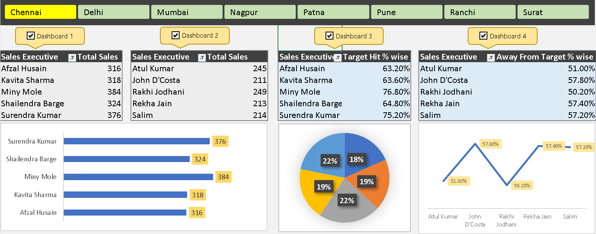

# 📊 Sales Analysis Dashboard (Excel)

## Overview

This Excel-based Sales Analysis Dashboard provides detailed insights into the performance of sales executives across multiple cities. It helps visualize both **total sales** and **target achievement metrics**, allowing teams to monitor progress and identify areas for improvement.

## Features

- 🏙️ **City-wise Dashboard Navigation**: Interactive tabs for Chennai, Delhi, Mumbai, Nagpur, Patna, Pune, Ranchi, and Surat.
- 👨‍💼 **Sales Executive Breakdown**: View individual performance by total sales or target metrics.
- 📈 **Performance KPIs**:
  - **Total Sales** by each executive
  - **Target Hit Percentage**
  - **Away From Target Percentage**
- 📊 **Visual Representations**:
  - Horizontal bar charts for total sales
  - Pie chart for sales distribution
  - Line graph showing deviation from targets

## Dashboards Included

- **Dashboard 1**: Chennai Sales Performance (Total Sales by Executive)
- **Dashboard 2**: Delhi Sales Performance (Total Sales by Executive)
- **Dashboard 3**: Patna Sales Target Achievement (% Hit)
- **Dashboard 4**: Pune Sales Gap Analysis (Away From Target %)

## Tools Used

- 📗 **Microsoft Excel**
- 📌 Slicers and interactive shapes for navigation
- 📊 Charts and conditional formatting for visualization

## How to Use

1. Download and open the Excel file.
2. Click on any city tab (Chennai, Delhi, etc.) to view respective dashboard.
3. Explore the dashboards to evaluate team and individual performance.
4. Use the visual aids to identify top performers and improvement areas.

